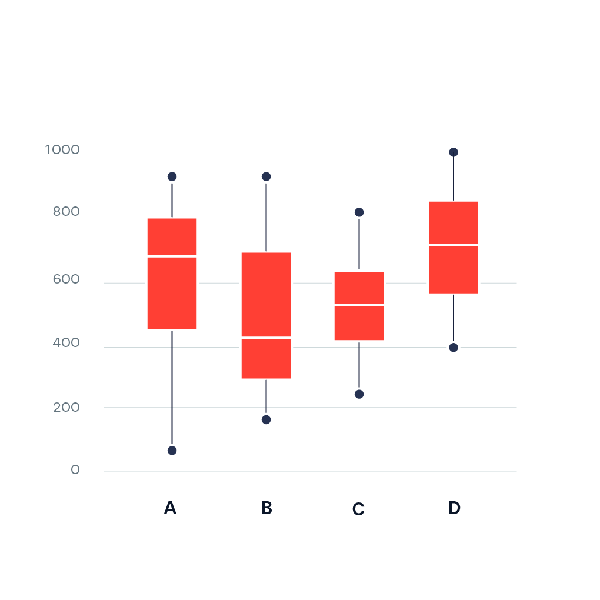
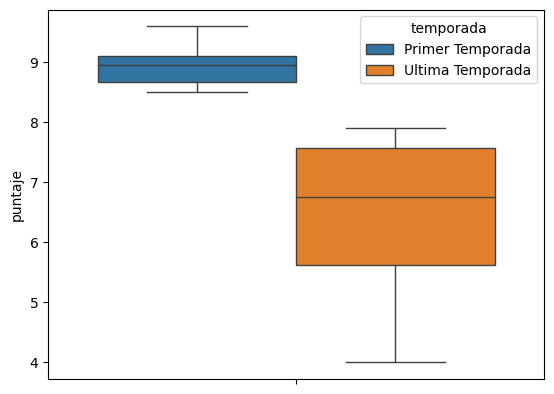
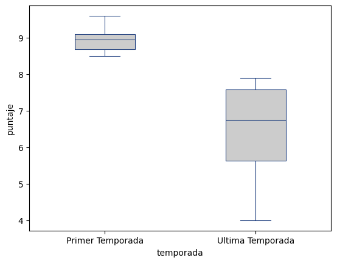

# Crear un **box plot** con Seaborn

Un box-plot, también conocido como diagrama de cajas, es una representación gráfica que muestra la distribución de un conjunto de datos a través de cuartiles estadísticos. Consiste en una caja rectangular que abarca el rango intercuartílico, es decir, el rango que va desde el primer cuartil (Q1) hasta el tercer cuartil (Q3). Dentro de la caja, una línea vertical indica la mediana (Q2) del conjunto de datos.

Los extremos de la caja se extienden hasta los valores más extremos dentro de un rango específico, llamados "bigotes". Puntos fuera de este rango se representan individualmente como posibles valores atípicos. Este tipo de gráfico es útil para visualizar la dispersión y la presencia de valores atípicos en un conjunto de datos, proporcionando una visión más completa de la distribución que un simple resumen estadístico.

 

Seaborn es una biblioteca de visualización de datos en Python basada en Matplotlib. Está diseñada para crear visualizaciones atractivas y informativas con facilidad. Seaborn proporciona una interfaz de alto nivel para crear gráficos estadísticos atractivos y está construida sobre Matplotlib, lo que significa que puede aprovechar las capacidades de Matplotlib mientras simplifica la creación de visualizaciones complejas.

Algunas de las características clave de Seaborn incluyen:

Estilo atractivo: Seaborn viene con estilos predefinidos que mejoran la apariencia de los gráficos de Matplotlib. Estos estilos son agradables visualmente y permiten personalizar fácilmente la apariencia de los gráficos.

Colores integrados: Seaborn ofrece paletas de colores predefinidas que pueden mejorar la presentación de sus gráficos. También facilita la creación de gráficos de colores categóricos y cuantitativos.

Facilidad de uso: Seaborn simplifica la creación de gráficos estadísticos comunes, como diagramas de dispersión, diagramas de caja, histogramas, mapas de calor y más. La sintaxis de Seaborn es más concisa y amigable que la de Matplotlib para muchos casos de uso.

Integración con DataFrames de Pandas: Seaborn se integra bien con DataFrames de Pandas, lo que facilita la visualización de datos almacenados en estructuras de datos tabulares.

En un box plot solo podemos visualizar variables de tipo cuantitativas. Para este ejemplo vamos a utilizar un pequeño dataset con los puntajes de los episodios de la primera y última temporada de Game of Thrones en la página IMDb.

Con tan solo una línea de código podemos obtener una primera visualización, y con pocas líneas más modificar características como color, lineas, íconos, tamaños, etc.

En el resultado final podemos comparar fácilmente las medidas de ambas temporadas, como las diferencias significativas entre la distribución y variabilidad de la calificación de los episodios. 